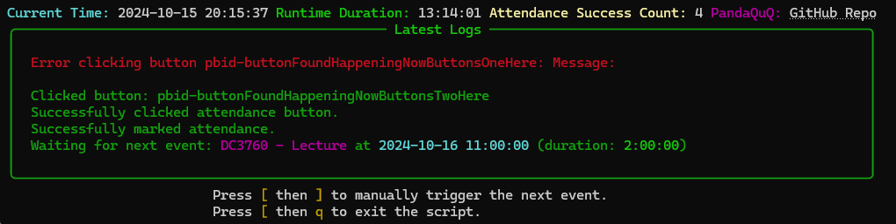

# RHUL Attendance Bot
[中文](https://github.com/PandaQuQ/RHUL_attendance_bot/blob/main/README_CN.md)
---

The RHUL Attendance Bot automates attendance marking for Royal Holloway students by using web automation. The script checks your calendar events, triggers attendance based on specified conditions, and provides real-time logging using Rich library for better visualization.

## Features

- **Automated Attendance**: Automatically opens the attendance page and marks your attendance based on your calendar events.
- **Manual Trigger**: Allows manual attendance marking via keyboard shortcuts.
- **Real-Time Logging**: Displays logs using Rich library for a better visual experience.
- **Environment and Dependency Checks**: Ensures the script is run in the proper environment and all dependencies are installed.
- **System Time Synchronization Check**: Checks if the system time is synchronized with the NTP server.
- **Auto-Update Feature**: Detects script updates and prompts the user to update.
- **Auto Login with 2FA**: Handles Microsoft login, switches to verification code, and auto-fills TOTP from your saved secret.

## Prerequisites

1. **Python 3.9 or above**: Ensure that Python is installed. If not, download and install it from [python.org](https://www.python.org/downloads/).
2. **Google Chrome Browser**: The script uses Chrome for web automation. Make sure it is installed.
3. **Virtual Environment (Recommended)**: Run the script inside a Python virtual environment to avoid dependency conflicts.

## Installation

### Step 1: Clone the Repository

```bash
git clone https://github.com/PandaQuQ/RHUL_attendance_bot.git
```

### Step 2: Navigate to the Project Directory

```bash
cd RHUL_attendance_bot
```

### Step 3: Set Up a Virtual Environment (Recommended)

#### On Windows:
```bash
python -m venv venv
venv\Scripts\activate
```

#### On macOS/Linux:
```bash
python3 -m venv venv
source venv/bin/activate
```

### Step 4: Install Dependencies

```bash
pip install -r requirements.txt
```

### Step 5: Create the ICS Folder

```bash
mkdir ics
```

### Step 6: Prepare Your Calendar File

- Go to [Royal Holloway Timetable](https://intranet.royalholloway.ac.uk/students/study/timetable/your-timetable.aspx)
- Select "Your Timetable" and log in
- Click "My Timetable" from the left sidebar
- In the "View Timetable As" dropdown, select `Calendar Download`
- Click the `View Timetable` button to go to the download page
- On the download page, click the `Android™ and others` button to get the download link
- Paste the download link in your browser to download the `.ics` file
- Place the downloaded `.ics` file in the `ics` folder located in the script's root directory

## Usage

1. **Navigate to the Script Directory**:

   ```bash
   cd RHUL_attendance_bot
   ```

2. **Activate the Virtual Environment**:

   #### On Windows:
   ```bash
   venv\Scripts\activate
   ```

   #### On macOS/Linux:
   ```bash
   source venv/bin/activate
   ```

3. **Run the Script**:

   #### On Windows:
   ```bash
   python RHUL_attendance_bot.py
   ```

   #### On macOS/Linux:
   ```bash
   python3 RHUL_attendance_bot.py
   ```

   > **✅ Auto Login + 2FA**
   > 
   > The bot now handles Microsoft login and the verification-code MFA flow automatically using your stored credentials and local TOTP secret. On first run, complete onboarding (credentials/secret + ICS download) as prompted; afterwards, login and 2FA are fully automatic.

4. **Keyboard Shortcuts**:

   - **Manually Trigger the Next Event**: Press `[`, then `]`
   - **Exit the Script**: Press `[`, then `q`

## Important Notes

- **Dependencies**: Make sure all required dependencies are installed by following the instructions in the `requirements.txt` file.
- **Virtual Environment**: Using a virtual environment is highly recommended to avoid conflicts with global packages.
- **System Time**: If the system time is not synchronized with the NTP server, the script will prompt you to synchronize your system clock.
- **Supported Platforms**: The script supports Windows, macOS, and Linux.

> **🔐 Security Note - Login Session Duration**
> 
> Due to the university's 2FA (Two-Factor Authentication) policy, a login session typically lasts about **one week**. 
> It is **strongly recommended** to regularly check the script status to prevent missed attendance.
> You may need to manually re-login after the session expires.

## Configuration

To configure the script, modify the relevant parameters inside the code or create a configuration file (not provided in this version). Future versions may include more flexible configuration options.

## Updating

If an update is detected, the script will prompt you to update. You can choose to update by typing `y` or skip it by typing `n`.

## Troubleshooting

1. **Chrome WebDriver Issues**: Make sure that the correct version of the ChromeDriver is being used. The script uses `webdriver-manager` to automatically manage ChromeDriver versions.
2. **Dependency Issues**: If you encounter errors related to missing modules, ensure you have installed all dependencies listed in `requirements.txt`.
3. **Virtual Environment Issues**: If you face issues while running the script, try setting up a fresh virtual environment and reinstalling the dependencies.

## TODO

Current focus / future ideas:

- ✅ **2FA Integration**: Microsoft verification-code path with TOTP auto-fill is implemented.
- ✅ **Automatic Login**: Stored credentials + TOTP drive a fully automatic login flow.
- ✅ **2FA Code Reading**: OTP is generated locally from your saved secret.
- 🔲 **Discord Webhook Bot**: Add Discord webhook notifications for attendance status

## License

This project is licensed under the MIT License with an additional clause. See the [LICENSE](LICENSE) file for details.

## Acknowledgments

- Thanks to the developers of [Rich](https://github.com/Textualize/rich), [Selenium](https://www.selenium.dev/), and [ics.py](https://github.com/C4ptainCrunch/ics.py) for their amazing libraries.

## Contact

For questions or suggestions, please feel free to reach out via the [GitHub repository](https://github.com/PandaQuQ/RHUL_attendance_bot). Feedback and contributions are welcome!
