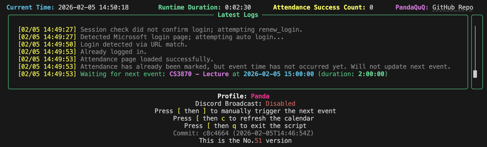
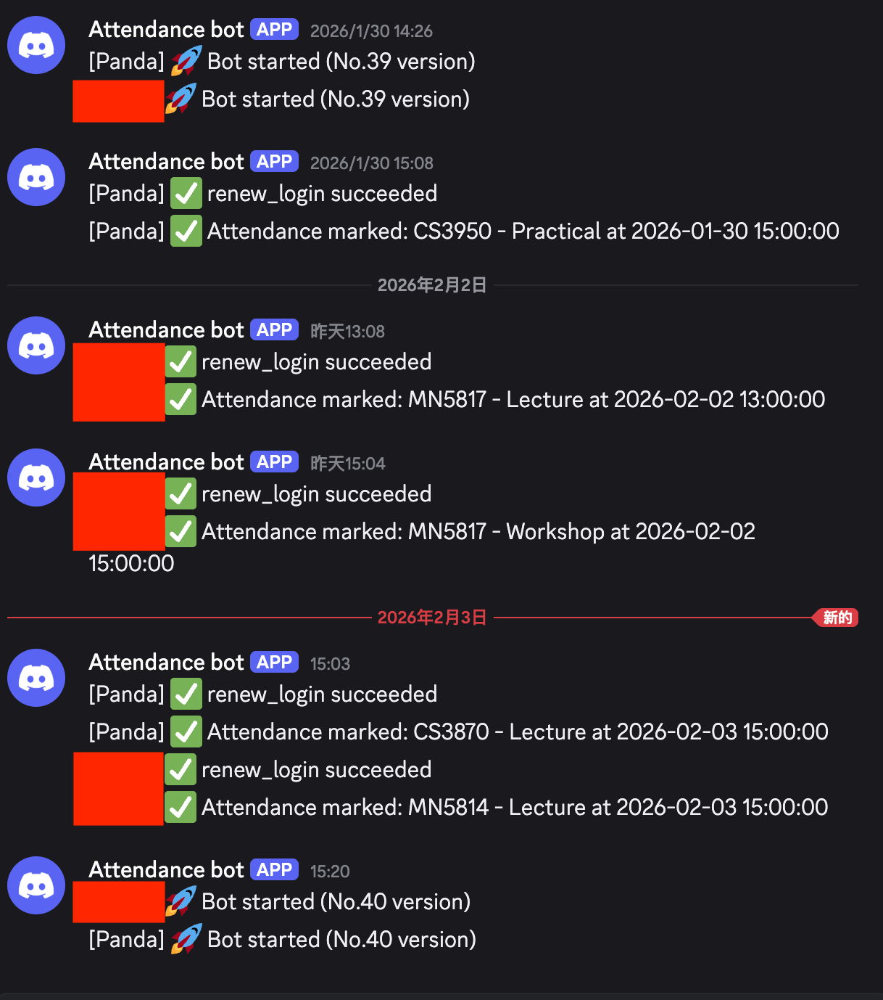

# RHUL 自动签到脚本
[English](https://github.com/PandaQuQ/RHUL_attendance_bot/blob/main/README.md)
---


RHUL 自动签到脚本通过使用网页自动化来为 Royal Holloway 学生自动签到。该脚本根据日历事件检查并触发签到操作，并使用 Rich 库进行实时日志记录，提供更好的可视化体验。


## 功能

- **自动签到**：根据日历事件自动打开签到页面并进行签到。
- **手动触发**：允许通过快捷键手动触发签到操作。
- **实时日志记录**：使用 Rich 库显示日志，提供更好的视觉效果。
- **环境和依赖检查**：确保脚本在正确的环境中运行并安装了所有依赖项。
- **系统时间同步检查**：检查系统时间是否与 NTP 服务器同步。
- **自动更新功能**：检测脚本更新并提示用户更新。
- **自动登录 + 2FA**：自动处理微软登录，选择“验证码”方式，并用本地保存的 TOTP 秘钥自动填充验证码。
- **自动下载课表**：首次运行自动下载课表到 `ics/` 目录，无需手动获取 `.ics` 文件。
- **Discord Webhook 通知（可选）**：配置 Webhook 后推送启动/停止、登录成功、签到成功等消息，并附带个人昵称。

## 前提条件

1. **Python 3.9 或以上**：确保已安装 Python。如果没有，请从 [python.org](https://www.python.org/downloads/) 下载并安装。
2. **Google Chrome 浏览器**：脚本使用 Chrome 进行网页自动化，请确保已安装 Chrome 浏览器。
3. **虚拟环境（推荐）**：在 Python 虚拟环境中运行脚本以避免依赖冲突。

## 安装

在安装前请先确保已安装 Google Chrome：可前往 [下载页面](https://www.google.com/chrome/)（macOS 也可使用 `brew install --cask google-chrome`）。

请从下面两种模式中选择：

1）**推荐：使用 pip 安装**
2）**源码运行**

### 模式 1：使用 pip 安装（推荐）

```bash
pip install rhul-attendance-bot
```

### 模式 2：源码运行

### 步骤 1：克隆代码仓库

```bash
git clone https://github.com/PandaQuQ/RHUL_attendance_bot.git
```

### 步骤 2：进入项目目录（仅源码安装需要）

```bash
cd RHUL_attendance_bot
```

### 步骤 3：设置虚拟环境（推荐）

#### Windows 系统：
```bash
python -m venv venv
venv\Scripts\activate
```

#### macOS/Linux 系统：
```bash
python3 -m venv venv
source venv/bin/activate
```

### 步骤 4：安装依赖

```bash
pip install -r requirements.txt
```

### 步骤 5：（可选）手动准备课表

脚本现已在首次运行时自动下载课表到 `ics/`。仅当自动下载失败时，才需要手动准备：

- 访问 [Royal Holloway 课表系统](https://intranet.royalholloway.ac.uk/students/study/timetable/your-timetable.aspx) 并登录。
- 选择 `Calendar Download`，点击 `View Timetable`，然后点击 `Android™ and others` 获取 `.ics` 链接。
- 下载 `.ics` 文件，并放入项目根目录的 `ics` 文件夹（如无则新建）。

## 使用说明

1. **进入脚本根目录**：

   ```bash
   cd RHUL_attendance_bot
   ```

2. **激活虚拟环境**：

   #### Windows 系统：
   ```bash
   venv\Scripts\activate
   ```

   #### macOS/Linux 系统：
   ```bash
   source venv/bin/activate
   ```

3. **运行脚本**：

   #### PyPI 安装：
   ```bash
   rhul-attendance-bot
   ```

   #### 源码运行：
   ```bash
   python RHUL_attendance_bot.py
   ```

   > **✅ 自动登录 + 2FA 已完成**
   > 
   > 现在脚本会自动处理微软登录和“验证码” MFA 流程，使用已保存的账号、密码和本地 TOTP 秘钥生成验证码。首次运行按引导完成账号/秘钥绑定；课表将自动下载。

4. **Profile 选择**：

    - 用 `-user <profile_name>` 指定 Profile，例如：
       ```bash
       rhul-attendance-bot -user 用户1
       ```
      - 不传 `-user` 且已有 Profile 时，会列出并让你选择。
      - 没有任何 Profile 时，会自动进入首次引导，完成后将 Profile 文件夹重命名为你的 Profile Nickname。

5. **清理本地数据**：

    - 使用 `-clean` 删除 `~/.rhul_attendance_bot` 下的所有本地数据：
       ```bash
       rhul-attendance-bot -clean
       ```

6. **快捷键说明**：

   - **手动触发下一个事件**：按下 `[` 然后按 `]`
   - **刷新课表（重新获取 ICS）**：按下 `[` 然后按 `c`
   - **退出脚本**：按下 `[` 然后按 `q`

## 注意事项

- **依赖项**：确保已根据 `requirements.txt` 文件的说明安装所有必需的依赖项。
- **虚拟环境**：强烈建议使用虚拟环境，以避免与全局包产生冲突。
- **系统时间**：如果系统时间与 NTP 服务器不同步，脚本会提示您同步系统时钟。
- **支持平台**：脚本支持 Windows、macOS 和 Linux 系统。

### 多 Profile 使用

Profile 数据存放在 `~/.rhul_attendance_bot/profiles/<profile_name>` 下，每个 Profile 独立保存：

- `credentials.json`
- `2fa_config.json`
- `ics/`
- `chrome_user_data/`
- `automation.log`

运行时用 `-user` 切换 Profile。

> **🔐 安全提示 - 登录会话时长**
> 
> ~~一次登录周期大约为一周，过期可能需要手动重新登录。~~
> 现在已支持使用存储的账号 + TOTP 自动续期登录。会话会自动刷新；如学校调整 2FA 策略，请偶尔检查运行状态。

## 配置

要配置脚本，可以修改代码中的相关参数，或者创建配置文件（当前版本不提供）。未来版本可能会增加更灵活的配置选项。

## 更新

如果检测到更新，脚本会提示您是否更新。可以输入 `y` 更新，也可以输入 `n` 跳过更新。

## 自动 Release 钩子（开发用）

仓库包含一个 Git 钩子：每次 commit 自动创建新 tag，并将小版本号（patch）+1。

本地启用方式：

```bash
git config core.hooksPath .githooks
chmod +x .githooks/post-commit
```

启用后，每次 commit 会生成类似 `v1.2.3` → `v1.2.4` 的新 tag。

## 常见问题

1. **Chrome WebDriver 问题**：确保使用的是正确版本的 ChromeDriver。脚本使用 `webdriver-manager` 自动管理 ChromeDriver 版本。
2. **依赖问题**：如果遇到缺少模块的错误，请使用 `pip install rhul-attendance-bot` 或从源码执行 `pip install -r requirements.txt`。
3. **虚拟环境问题**：如果运行脚本时出现问题，请尝试重新设置虚拟环境并重新安装依赖项。

## TODO

当前进展 / 后续想法：

- ✅ **集成 2FA**：已实现微软验证码通道，自动填充 TOTP。
- ✅ **读取 2FA 验证码**：使用本地秘钥生成 OTP 并自动填写。
- ✅ **自动登录**：已实现全自动登录流程。
- ✅ **Discord Hook Bot**：已支持 Discord Webhook 通知（可选，Webhook 置空即禁用），推送签到状态、登录和生命周期事件
- ✅ **PyPI 发布**：已发布，可通过 `pip install rhul-attendance-bot` 安装

## 许可证

本项目采用 MIT 许可证。有关详细信息，请参阅 [LICENSE](LICENSE) 文件。

## 鸣谢

- 感谢 [Rich](https://github.com/Textualize/rich)、[Selenium](https://www.selenium.dev/) 和 [ics.py](https://github.com/C4ptainCrunch/ics.py) 库的开发者。

## 联系方式

如有问题或建议，请通过 [GitHub 仓库](https://github.com/PandaQuQ/RHUL_attendance_bot) 联系我。欢迎反馈和贡献！
